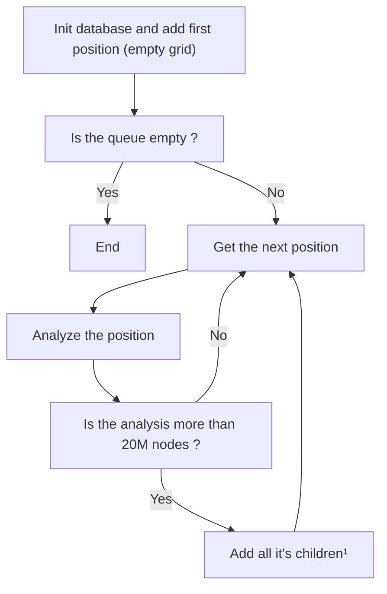

This README file is to explain the purpose of the book package and how to use it.

## 📋 Summary

### 1. [General Idea](#1---general-idea)

### 2. [How to use](#2---how-to-use)

### 3. [Implementation Details](#3---implementation-details)

## 1 - General Idea

The early a position is in the game, the more possible moves there are, and the more time it takes to solve/analyze it in average.

For example, an empty position takes 22 minutes (on my machine) to be analyzed, and it keeps decreasing as the game goes on. So to time window for a position to be analyzed is between 0 and 22 minutes. So imagine if we want to use this solver to play perfectly against a human, we don't want to wait 22 minutes for the first move to be analyzed, neither do we want to wait x minute/seconds for each time it's the solver to play.

An idea to solve this problem is to create a book of positions, where we pre-compute the analysis of each position up to an arbitrary depth.

The issue with this approach is that it takes a lot of time/space to create such a book, as the number of positions grows exponentially with the depth (7^depth).

The best approach in my opinion is to create a partial book instead of a complete book, where we only save the analysis of positions that take less than a certain amount of time to be analyzed. This way we can still get a good book of positions, without having to wait for days or weeks for it to be analyzed.

In practice, I use the number of nodes instead of the time because it's more consistent across different machines, and it's easier to measure. In the end, when solving/analyzing a position, if it's in the book, we can just return the result without having to analyze it. If it's not in the book, we can analyze it as usual and it should take less than a few seconds. With this, it should be possible to play a live game against the solver.

## 2 - How to use

The book is represented as a map where the key is the position's key and the value it's analysis. The book is saved in `database/map.go` as a Go map, so it can be easily imported and used in the solver.

The book uses BadgerDB to store the positions and their analysis. If you want to create your own book, just call the `CreateBook` function in the `main.go` file with the desired depth database path.

After it's done, run the command `go generate ./...` to re-generate the `map.go` file from the database.

## 3 - Implementation Details

In addition to the naïve implementation where you just do a Breadth-First Search (BFS), I used the fact that a position of Connect-4 is symmetric, so we can litteraly skip half of the positions by always getting the canonical key of a position. The canonical key is the smallest key between the position's key and the mirrored position's key.

The next optimisation is what I call "early pruning". If a position takes less than 20 million nodes to be analyzed, there is no use to analyze it's children positions, because a children always take less node to be analyzed than it's parent. With this, we only care about the branches of of the position tree that have "hard" positions.

To clarify how the book is created, here is a organigram of what's happening when we call the `CreateBook` function:

> [!NOTE]
> ¹: The childrens of a position are the 7 positions that can be reached by playing in one of the 7 columns. If the column is full, there is no children to add. If a children directly leads to a win, the child is not added (skipped).
